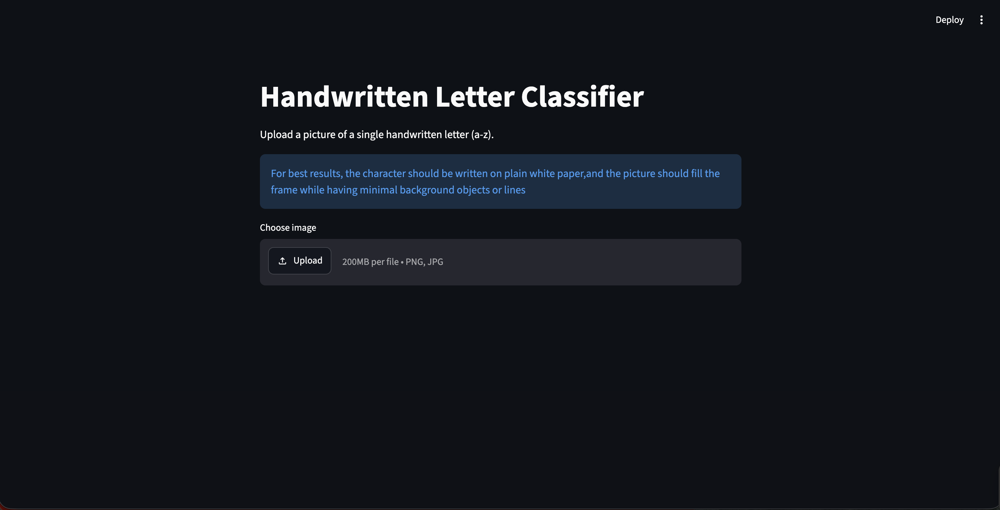
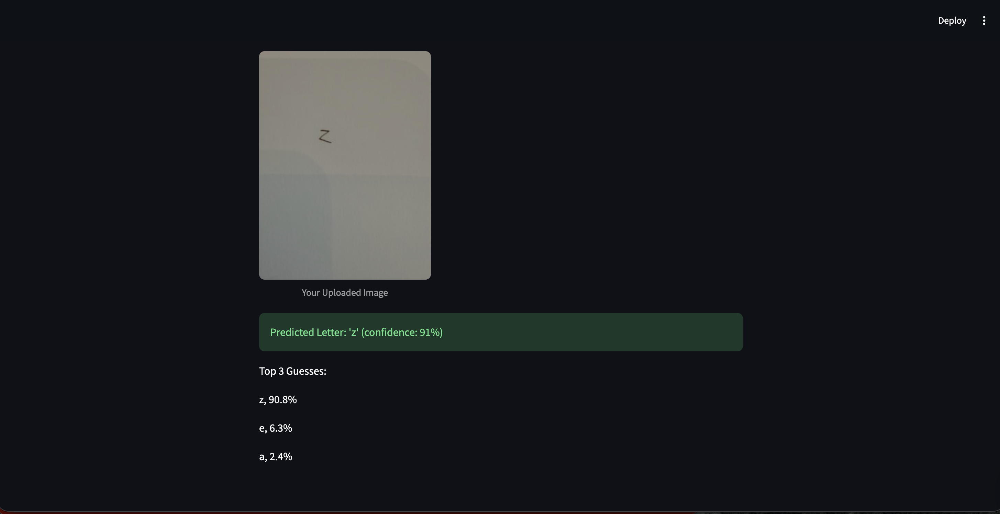

# Handwritten Letter Classifier (CNN + OpenCV Preprocessing)

A convolutional neural network that classifies handwritten letters (A–Z) from
uploaded photos. Built with PyTorch, trained on EMNIST, and served through a
Streamlit web app. Includes a custom OpenCV preprocessing pipeline that turns
real-world photos (shadows, uneven lighting, arbitrary framing) into the clean
format the model expects.

## What it does

Upload a photo of a single handwritten letter and the app preprocesses it,
runs it through a trained CNN, and returns the predicted letter with confidence
scores. If the model isn't confident the image is a clear letter, it says so
rather than guessing.

## How it works

**Model:** A CNN (two convolutional layers + two fully-connected layers) trained
on the EMNIST "letters" split (~124k training images, 26 classes). Reaches
~93% test accuracy.

**Preprocessing pipeline** (the part that handles real photos):
1. Convert to grayscale
2. Adaptive thresholding — handles uneven lighting and shadows by comparing each
   pixel to its local neighborhood rather than a global cutoff
3. Contour detection — locates the letter and rejects shadow-edge artifacts
4. Crop, square-pad, and center to match EMNIST's framing
5. Resize to 28×28 and apply EMNIST's orientation and normalization

## Limitations 

- **Test vs. real-world gap:** ~93% on clean EMNIST test data; lower on real
  uploaded photos, since real handwriting/lighting differs from training data.
- **Ambiguous letters:** The model confuses genuinely similar pairs — `i`/`l`,
  `g`/`q`, `u`/`v` — because these are nearly identical as isolated characters.
  This is a data-ceiling limit, not a tuning issue.
- **No "not a letter" detection:** Shown a non-letter, the model still picks a
  letter, though usually with low confidence — the app flags low-confidence
  predictions for this reason.
- **Input sensitivity:** Works best on a single, clearly-written letter that
  fills the frame, with even lighting and minimal background.

## Running it

```
pip install -r requirements.txt
streamlit run app.py
```

## Files
- `app.py` — Streamlit interface + preprocessing pipeline
- `training.py` — model definition and training
- `emnist_cnn.pth` — trained model weights

## Demo


